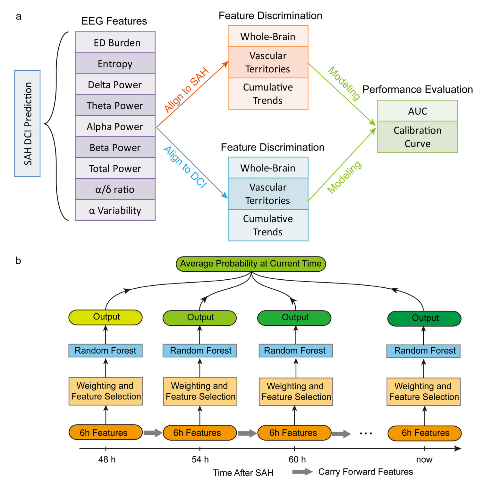

# EEG Data Processing Pipeline

## Table of Contents
- [Overview](#overview)
- [Pipeline Steps](#pipeline-steps)
  - [Step 1: EEG Data Preprocessing](#step-1-eeg-data-preprocessing)
  - [Step 2: Feature Extraction](#step-2-feature-extraction)
  - [Step 3: Merge Features](#step-3-merge-features)
  - [Step 4: Generate Vascular & Asymmetry Features](#step-4-generate-vascular--asymmetry-features)
  - [Step 5: Align Features with DCI](#step-5-align-features-with-dci)
  - [Step 6: Baseline Model](#step-6-baseline-model)
  - [Step 7: Carry Forward Model](#step-7-carry-forward-model)
- [Installation](#installation)
- [Usage](#usage)
- [Contributing](#contributing)
- [License](#license)
- [Contact](#contact)
- [Acknowledgments](#acknowledgments)

## Overview
This repository hosts the code for the paper: Zheng WL, et al. (2022). Automated EEG-based prediction of delayed cerebral ischemia after subarachnoid hemorrhage. *Clinical Neurophysiology, 143*(97-106). [DOI: 10.1016/j.clinph.2022.08.023](https://doi.org/10.1016/j.clinph.2022.08.023). PMID: 36182752; PMCID: PMC9847346. The repository outlines a comprehensive pipeline for processing EEG data from raw EDF files to predict delayed cerebral ischemia (DCI) using both the baseline model and max carry forward model described in the paper, as well as for the visualization of results. The pipeline details all steps from data preprocessing to final model evaluation.

## Abstract
**Objective**: Delayed cerebral ischemia (DCI) is a leading complication of aneurysmal subarachnoid hemorrhage (SAH) and electroencephalography (EEG) is increasingly used to evaluate DCI risk. The goal of the paper is to develop an automated DCI prediction algorithm integrating multiple EEG features over time.
**Methods**: Assess 113 moderate to severe grade SAH patients to develop a machine learning model that predicts DCI risk using multiple EEG features.
**Results**: Multiple EEG features discriminate between DCI and non-DCI patients when aligned either to SAH time or to DCI onset. DCI and non-DCI patients have significant differences in alpha-delta ratio (0.08 vs 0.05, p < 0.05) and percent alpha variability (0.06 vs 0.04, p < 0.05), Shannon entropy (p < 0.05) and epileptiform discharge burden (205 vs 91 discharges per hour, p < 0.05) based on whole brain and vascular territory averaging. Our model improves predictions by emphasizing the most informative features at a given time with an area under the receiver-operator curve of 0.73, by day 5 after SAH and good calibration between 48–72 hours (calibration error 0.13).
**Conclusions**: The proposed model obtains good performance in DCI prediction.
**Significance**: Leveraged machine learning to enable rapid, automated, multi-featured EEG assessment and has the potential to increase the utility of EEG for DCI prediction.

## Pipeline Steps

### Step 1: EEG Data Preprocessing
- **Input**: Raw EEG file (.edf format).
- **Process**: Read raw EEGs, save available channels, filtering, artifact reduction.
- **Output**: Processed EEG files (.mat) stored in './Preprocessed'.
- **Purpose**: Prepare raw EEG data for feature extraction. This is a preprocessing step that can also be done by commercial softwares under your own choice.

### Step 2: Feature Extraction
- **Input**: Processed EEG files from Step 1.
- **Process**: Extraction of 7 global features performed on bipolar signals. the global features are :'Shannon', 'AlphaDeltaRatio', 'TotalPow', 'DeltaPow', 'ThetaPow', 'AlphaPow', 'PercentAlphaRatioVariability'.
- **Output**: .mat file for each EEG, stored in './Features'.
- **Purpose**: Derive meaningful metrics from EEG data.

### Step 2b & Step2c: Spike Feature Extraction
- Spike detector output from Westover lab--SKIP THIS STEP.
- These steps are for spike (you can modify this part for your spike pipeline, if applicable), current file unmodified and unused.

### Step 3: Merge Features
- **Input**: Features from previous steps (from './Features') combined with patient info.
- **Output**: Global feature matrix of all patients.
- **Purpose**: Merges 7 global eeg features with spike features from every patient's .mat  to a single.mat; calculate feature_score - the weights based on artifact detection

### Step 3v: Visualization - Cumulative features
- **Input**:  Global feature matrix of all patients.
- **Output**: Heatmap representation and Line Plots of distribution for two groups on selected features(PAV, ADR, ED burden) in a cumulative way, t-test performed.

### Step 3v: Visualization -  Feature Analysis Per Hour
- **Input**:  Global feature matrix of all patients.
- **Output**: Heatmap representation and line plots of distribution for two groups on global features under selection.

### Step 3b: Remove Samples after DCI
- **Input**: Global feature matrix of all patients, Vascular feature matrix, Asymmetry feature matrix combined with patient info.
- **Output**: Three new feature matrix.
- **Purpose**: Remove value after DCI onset time to 'NaN'.

### Step 4: Generate Vascular & Asymmetry Features
- **Input**: Features from previous steps.
- **Output**: Enhanced feature set with vascular and asymmetry information.
- **Purpose**: Improve model accuracy with detailed feature sets.

### Step 4v: Visualization -  Vascular Analysis
- **Input**:  vascular_features.mat
- **Output**: Heatmap representation and line plots of distribution for two groups on vascular features under selection.

### Step 5: Align Features with DCI
- **Input**: Features and DCI event data from patients' info.
- **Output**: Aligned feature set.
- **Purpose**: Align features to DCI onset for each patient, for non-DCI patient, a one-to-one match was set up (generated in this step).

### Step 5A: Align Features with DCI one-to-multiple
- **Input**: Features and DCI event data from patients' info, ctrl_matchtime_dci.mat.
- **Output**: Aligned feature set.
- **Purpose**: Align features to DCI onset for each patient, for non-DCI patient, a one-to-multiple match was set up (ctrl_matchtime_dci.mat), where one DCI patient will have multiple non-DCI patient match who have recordings in the same time frame aligning to SAH. Control_matchtime_dci.mat from previous published Jenn's method. (Jenn's method/paper method)

### Step 5v: Visualization -  Align features with DCI
- **Input**: Aligned feature set.
- **Output**: Heatmap representation and line plots of distribution for two groups on features aligned to DCI onset under selection.

### Step 5v: Visualization -  Align features with DCI one-to-multiple
- **Input**: Aligned feature sets.
- **Output**: Heatmap representation and line plots of distribution for two groups on features aligned to DCI onset under selection. visualization of cumulative features aligned to DCI for all patients

### Step 6: Baseline Model
- **Input**: Feature sets.
- **Output**: Baseline model and prediction matrix.
- **Purpose**: Establish a predictive baseline(RandomForest) for performance comparison.

### Step 6B: Baseline Evaluation
- **Input**: Model outputs.
- **Output**: AUC and plots of the results.
- **Purpose**: Calculate the AUC of the model, the AUC is calculated for each trial (n_trial*n_time_range). Plot the AUC of each time range of mean value of all trials. Plot average AUC of each time range from start to current range. 

### Step 6C: Baseline Model Align DCI
- **Input**: Aligned feature sets.
- **Output**: Baseline model and prediction matrix.
- **Purpose**: Establish a predictive baseline(RandomForest) for performance comparison on features aglined to DCI onset.

### Step 6D: Baseline Evaluation Align DCI
- **Input**: Model outputs.
- **Output**: AUC and plots of the results.
- **Purpose**: Calculate the AUC of the model trained on dataset aligned to DCI onset, the AUC is calculated for each trial (n_trial*n_time_range). Plot the AUC of each time range of mean value of all trials.

  
### Step 7: Carry Forward Model
- **Input**: Feature sets.
- **Output**: Max carry forward model and prediction matrix.
- **Purpose**: Train carry forward model on dataset that consist of selected features and cumulative features, the features are interpolated. The features on each hour will be optimized to the value of feature that maximize the difference between two groups from hour_1 to hour_current, calculated from data from 113 pt.

### Step 7B: Carry Forward AUC evaluation
- **Input**: Model outputs.
- **Output**: Model evaluation figures.
- **Purpose**: Plot AUC of max carry forward model considering only data up through the time of DCI to represent prediction performance prior to DCI onset. Shaded areas denote 95 % confidence intervals. Plot swimmer plot of prediction probabilities over time for individual patients (one row per patient)l. Red triangles represent delayed cerebral ischemia (DCI) events. DCI events later than 10 days after SAH were marked on day 10.

### Step 7C: Calibration Evaluation
- **Input**: Model outputs.
- **Output**: Calibration curves.
- **Purpose**: Plot calibration curve at 48-72 h after DCI. Plot calibration curve 12 h prior to DCI time

### Step 7D: Carry Forward AUC evaluation 6h average
- **Input**: Model outputs.
- **Output**: Model evaluation figures.
- **Purpose**: Plot of AUC of each time range of max carry forward model considering only data up through the time of DCI to represent prediction performance prior to DCI onset. Shaded areas denote 95 % confidence intervals. The AUC is calculated based on averaged predited probabilities from begining to current time range.

## Usage
Step1 is written in python and other steps in matlab. Example files in corresponding folders. Feature matrix contains data of all patients.

## Contact
For issues regarding the pipeline, please contact zhongwei.jin@yale.edu.

## Acknowledgments
- Thanks to all contributors who have participated in this project.
- Thanks to all related research institutions and supporters.
- Special thanks to Dr. Weilong Zheng who is the original coder of this project.
